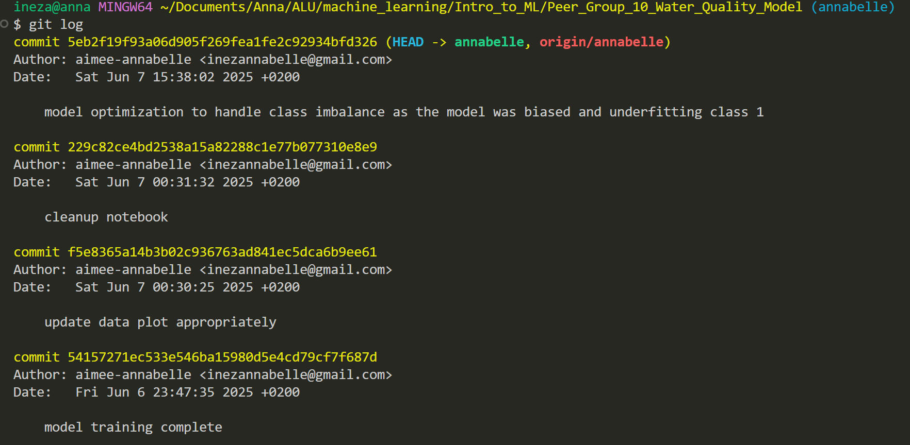

# Classification Model Using Neural Networks

## Report

### Git Log
1. Annabelle Ineza 

### Training summaries

#### Annabelle Ineza
The data contained missing values and I handled it by replacing them with medians(Keeps all data instead of dropping rows. Better for training deep models which need more data). After model training I noticed and Imbalance in classes (class 1 was being underperformed) so I used class weights during training. This Gives more importance to the minority class (potable water) so the model doesn’t ignore it.

**What I used and why:**
- Dropout (0.3 to 0.4): Keeps the model general, but not too weak.
- L2 Regularization: Penalizes overly complex weights, helps with generalization.
- Training Choices => Adam Optimizer, Learning Rate: 0.001 (Faster and adaptive, with good convergence properties)
- EarlyStopping (patience=20): Stops training early if validation loss doesn’t improve, avoiding overfitting.
- ReduceLROnPlateau: If model stops improving, it lowers the learning rate gradually.
- Threshold Optimization: Tested thresholds between 0.3–0.7. Found that 0.35 gives the best F1-score for potable water. Without this, the model underperformed on the minority class.

### Insights

### Summary Table

| Train Instance | Engineer Name | Regularizer | Optimizer | Early Stopping | Dropout Rate | Accuracy | F1 Score | Recall | Precision |
| -------------- | ------------- | ----------- | --------- | -------------- | ------------ | -------- | -------- | ------ | --------- |
| 1 | Annabelle Ineza | L2(0.01) | Adam (lr=0.001) | yes (Patience=20) | 0.3/0.4/0.2 | 0.57 | 0.59 | 0.83 | 0.46 |
| 2 | Armand Kayiranga | L1 | Adam |               |              |          |          |        |           |
| 3 | Reponse Ashimwe  | L2 | RMSprop |            |              |          |          |        |           |
| 4 | Nelly Iyabikoze | L1 | RMSprop |             |              |          |          |        |           |
| 5 | Roxanne Niteka |     |         |             |              |          |          |        |           |